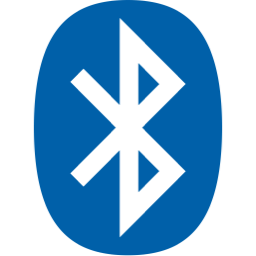
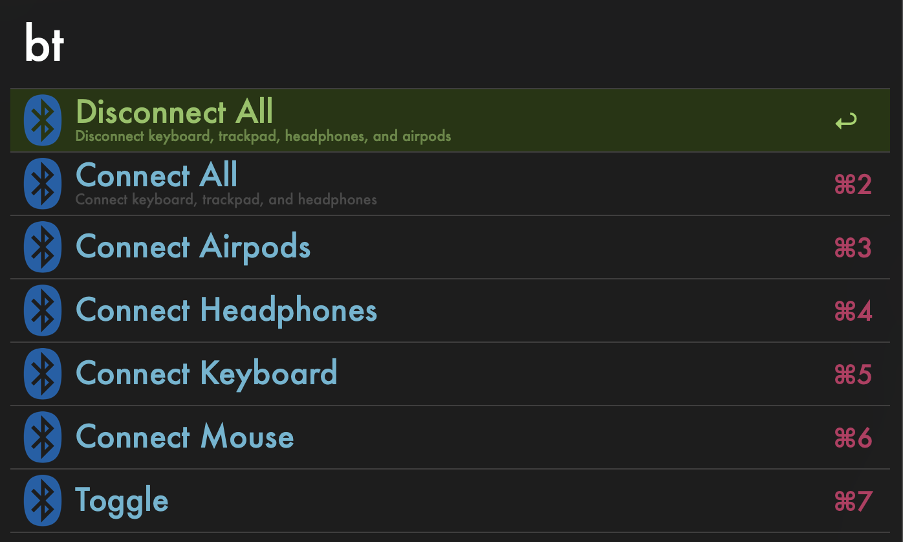

#  Bluetooth Toggle Alfred Workflow

Control your bluetooth connections and power with Alfred

<a href='https://github.com/brylok/bluetooth-toggle-workflow/releases/download/2023.1/Bluetooth.Toggle.alfredworkflow'>⤓ Download Here</a>

## Dependencies

You must install <a href="https://github.com/toy/blueutil">blueutil</a> to use this workflow.  I find the easiest way is to use <a href="https://brew.sh/">homebrew</a>.  

`brew install blueutil`

## Usage

Update the status of your bluetooth connections by using the bt control keyword (default: `bt`) and then press space to see a list of options.

## Configuration

Many settings are available through the built-in workflow configuration tool. You must configure the MAC addresses of your devices for this workflow to work.

## Thanks

Big Thanks to [toy](https://github.com/toy) for making such a helpful library.
